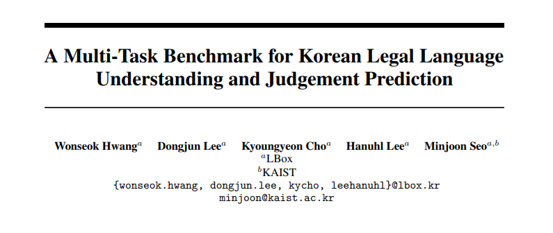
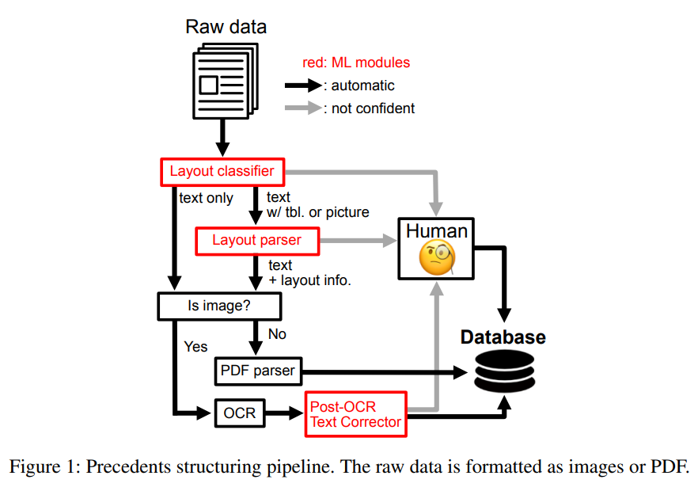
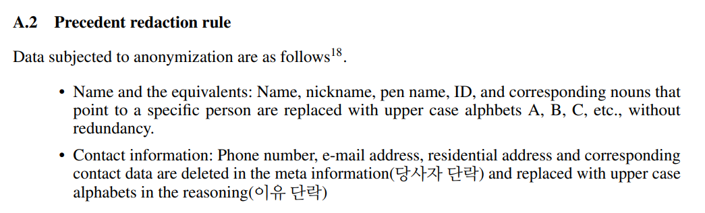
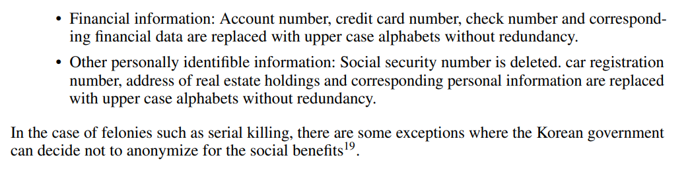
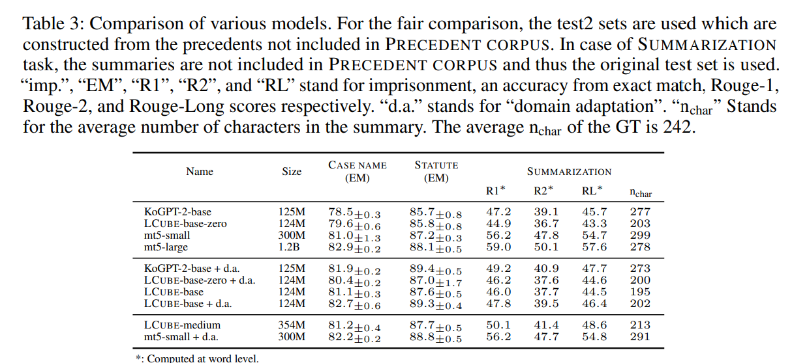
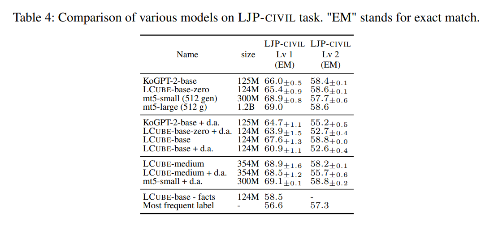

 
paper: https://arxiv.org/pdf/2206.05224.pdf   

## Abstract  
법률 인공지능에 사용할 수 있는 한국어 법률 데이터셋인 LBOX OPEN과 한국어 법률 자연어처리 모델인 LCUBE를 공개한다.  

https://github.com/lbox-kr/lbox-open   

## Introduction 
엘박스 오픈(LBOX OPEN) 데이터셋은 아래처럼 구성되어 있다  

1) 하나의 법률 용어집(PRECEDENT CORPUS/ one legal corpus): 근 44년간의 147k 한국 판례 모음 (259M개의 토큰들)  

2) 두 개의 분류 태스크(two classification tasks) 
    2-1) 사건 이름 분류(CASE NAME / case names), 11.3k의 facts와 case name 페어 
    2-2) 법령 예측(STATUTE / statutes preediction), 2.8k의 facts와 거기에 상응하는 법령들  
    
3) 두 개의 법률 판결 예측(two legal judgement predictions, LJP) 
    3-1) 벌금 액수/노역형/노역이 없는 수감형을 예측하는, 10.5k 범죄 샘플들 (LJP-CRIMINAL) 
    3-2) 구제 정추(claim for relief)와 사실들이 input, 주장을 받아들이는 정도를 output으로 하는, 4.7k 민사 샘플들(LJP-CIVIL)  
    
4) 하나의 요약 태스크(one summarization task) 
    4-1) 대법원 판례들과 이에 상응하는 요약본들, 20k (SUMMARIZATION)  
    
또한, 케이스에서 드문 케이스 카테고리들에 대한 데이터들(CASE NAME+, 31k 샘플), 법령 분류 태스크들(STATUTE+, 17.7k 샘플), 요약 태스크에서의 긴 인풋 시퀀스들(SUMMARIZATION+, 51k 샘플)들도 포함시켰다.   

이 엘박스 오픈 데이터셋을 사용해서 사전 학습을 시킨, 첫번째 한국어 법률 언어 모델인 엘큐브(LCUBE)도 발표한다. 
GPT2에 기초한 encoder-only 모델로, text classification 문제에서 m5(encoder-decoder LM)와 경쟁해볼만한 성과를 이뤘으나, summarization 태스크에서는 엘큐브가 다른 모델들 대비 특별한 이점을 보이지 못했다.   

## Background 
### 한국 법률 시스템 
한국의 법률 시스템은 지방법원(district courts), 고등법원(high courts), 대법원(Supreme Court)의 3단계 정의 시스템이다. 지방법원과 고등법원은 사건의 진실과 법률 문제를 다투지만, 대법원에서는 법률 문제만 다룬다는 차이점이 있다.  

또한 civil law 체계로, 성문화된 법령((codified statute)이 메인 역할을 하며, 판례들은 부수적인 역할을 한다. (반대로 common law 체계에서는 판례들이 메인 역할을 하며, 법률이 제한하는 범위가 크지 않아서 계약 하나를 작성해도 하나하나 싹 다 계약서 안에 포함시켜야 한다. civil law 체계에서는 인권 등의 내용이 이미 성문화되어 있기 때문에, 해당 내용을 제외하고 계약서를 작성해도 법의 보호를 받는다) 

이 때문에 한국에서는 common law 체계에서의 선례구속성(doctrine of stare decisis)은 없는 편이고, 법원조직법(Court Organization Acts)은 어떤 사건에 대해 더 높은 단계의 법원에서 내린 결정은, 특정 사안에 대해서만 하위 법원에서 따르게 한다고 명시하고 있다. 하지만 이는 원칙적인 것이고, 실제 현실에서는, 법령이 사회 현상 전체를 커버할 수 없기 때문에, 상위 법원, 특히 대법원에서 결정된 사안은 대부분 하위 법원에서도 따르고 있다  

  

### 한국 판례 
#### 한국 판례의 구조 
5개의 메인 파트로 이루어져 있다 
(1) 메타 정보 (사건 번호, 원고들, 피고들, 작성 날짜) 
(2) 민사 사건에서의 원고 주장의 요점(청구 요지) 
(3) 판결 
(4) 추론 섹션 (4-1)진실, (4-2)주장들, (4-3)추론, (4-4)결정  

#### 편집 과정 
데이터셋 공개를 위해서, 한국 정부의 공적인 편집 과정을 따랐다. 이 과정에 의거, 모든 데이터의 개인정보는 아래의 과정(Appendix A.2)을 따라 익명화되었다  

 
  

- 이름과 그와 비슷한 것들: 이름, 닉네임, 펜 네임, 아이디 등과 상응하는 명사들은 A,B,C 등의 대문자 영어로, 특정인을 중복없이 대체한다 
- 접촉 정보: 전화 번호, 이메일 주소, 집 주소와 그에 상응하는 데이터들은 메타 정보(당사자 단락)에서 삭제하고, (이유 단락)에서의 대문자 영어로 대체한다 
- 금융 정보: 계좌 번호, 신용카드 번호, 수표 번호 등과 상응하는 금융 데이터들, 이 정보들 역시 중복없는 알파벳 대문자 영어로 대체한다. 
- 기타 개인적으로 식별가능한 정보: 사회보장 번호는 삭제, 자동차 번호, 보유한 부동산 주소 등과 이에 상응하는 개인 정보들 역시, 중복 없는 알파벳 대문자 영어로 대체한다  

연쇄 살인마같은 중범죄자의 경우, 한국 정부가 몇몇 정보는 그냥 공개하는 예외가 있을 수 있다  

#### 판례 공개 상태 
민형사소송법(Civil and Criminal Procedure Act.)에 의거, 법원은 대법원 홈페이지에 그 결과를 공개하고 있으며, 판례는 지적재산권 보호법과 무관하다. 이 때문에 논쟁의 여지가 있다   

## 엘박스 데이터셋 제작 과정 

한국 판례는 문서형 이미지와 pdf의 두 가지 포맷으로 저장된다. 도표와 테이블, 문장들이 한 페이지 안에 전부 다 같이 있어서, 생각보다 파싱이 까다롭다. 이를 자동화하기 위해서 아래와 같은 과정을 거쳤다  

  

여기서 Layout Classifier는, ResNet에 기반을 두고 있으며, 각 페이지를 '텍스트만 있음','텍스트와 테이블','그림'으로 구분한다 
다음으로, Mask RCNN에 기반한 Layout Parser를 사용해서, 텍스트가 아닌 부분들을 분할했다. 
- 만약 페이지가 pdf 형식이면, 텍스트를 먼저 뽑아낸 다음, rule based parser를 사용하고 난 다음, 데이터베이스로 보냈다 
- 만약 페이지가 이미지라면, 적합한 OCR 엔진을 사용했다. 이 모델은 한국어 character level transformer를 백본으로 사용하고 있으며, confidence 스코어가 정해진 임계치 미만이면 사람이 작업했다. 이후에 OCR 에러 교정을 위한 language model을 쓰고, 그 다음에야 데이터베이스로 보냈다  

마지막으로 json 포맷으로 문서를 저장했는데, 여기에는 (1) 메타 정보, (2) 판결, (3) 청구의 요지, (4) 어필, (5) 사실,주장,추론,결론등이 합쳐진 결과를 포함되어 있다. 

## 실험 
- learning rate: 3e-5 ~ 1e-4 
- batch size: 8 ~ 16 
- optimizer: AdamW  

mt5-small의 파인튜닝을 위해서 google/mt5-small 체크 포인트를 사용했고, 엘큐브(LCUBE)를 위해서는 메가트론 라이브러리(Megatron library)를 사용해서, 바닥부터 GPT2를 판례 코퍼스(PRECEDENT CORPUS)와 모두, 위키 데이터로 사전 학습시켰다.  
또한, 형태소 단위 바이트 레벨 BPE를 tokenization을 위해 사용했다 (한국어는 형태소 변화가 변화무쌍한 고착어라서)  

### 메트릭 
CASE NAME, STATUTE, LJP-CIVIL tasks를 위해서는 정확도(accuracy, 라벨과 string이 정확하게 동일하면 맞은 것으로 간주)를 사용했고, LJP-CRIMINAL tasks를 위해선 각 필드(벌금/노역형/노역없는 수감)마다 F1 스코어를 사용했다.   

 
  

