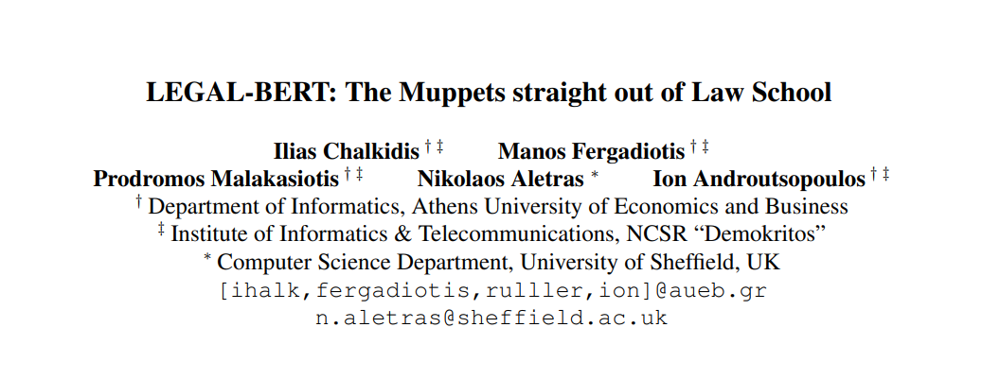
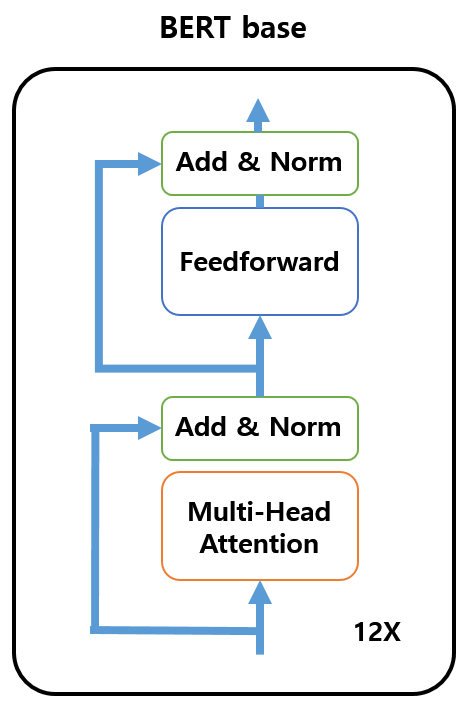
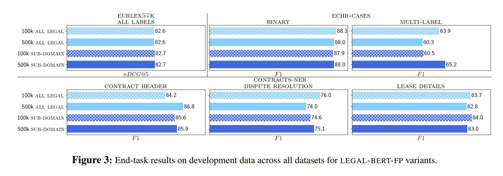
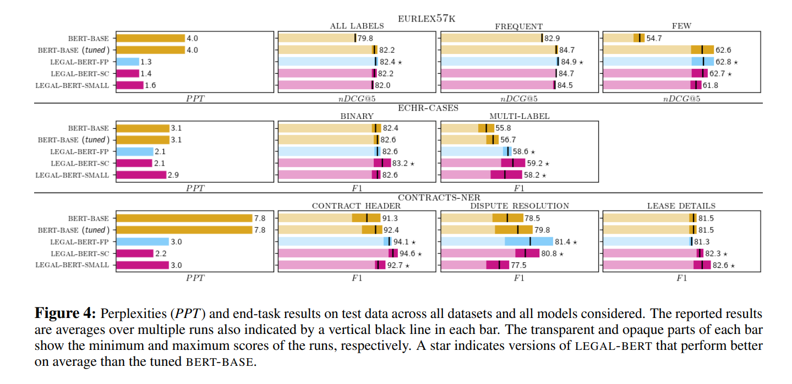

 
paper: https://arxiv.org/pdf/2010.02559.pdf   

## Abstract  

BERT는 여러 NLP 태스크들에서 괄목할만한 퍼포먼스를 보이고 있지만, 특수한 도메인들에 적용하는 것에 관해서는 연구가 덜 된편이다. 우리는 법률 도메인에 중점을 두고,  BERT 모델을 다운스트림 법률 태스크들에 적용해볼 것이다.  

 
 

BERT의 적용 방법은 

(a) 오리지널 버트 (BERT-BASE) 

(b) (법률) 도메인 언어 데이터로, 추가 사전 학습을 거친 BERT (LEGAL-BERT-FP / Further Pre-train) 

(c) 처음부터 (법률) 도메인 특화 데이터로, 사전 학습시킨 BERT (LEGAL-BERT_SC / SCratch)  

  

## Specifications for Experiment of Legal BERT 

Training corpora(트레이닝할 때 쓴 데이터셋들): 입법관련(legislation), 소송 사건들(court cases), 계약관련(contracts) 등의 영어 법률 문서를 12GB 가량 수집해서 사용했다. 

Legal BERT FP (Further Pre-training BERT 모델): 기존 BERT모델에 도메인 특화(법률) 데이터로 추가 사전 학습을 진행했다. 원본 BERT에서는 추가 스텝을 최대 100k하라고 했지만, Legal BERT에서는 최대 500k 스텝까지 늘려서 진행했다. 이는 다운스트림 태스크에 맞춰서 파인 튜닝을 진행할 때, 연장시킨 도메인 내에서의 사전 학습이 어떤 영향을 끼치는지- 알아보기 위해서였다. 

이렇게 BERT-BASE 모델을 일반적인 NLP데이터셋에 대해서, BERT 논문의 스텝수보다 훨씬 더 많이 늘려서 학습을 시켰는데,  (일반 NLP데이터셋에 더 적합하도록) 30k  가량의 서브 워드(sub-words)도 사용했다.  

 

Legal BERT SC (training from SCratch): BERT-BASE와 마찬가지로 12개의 레이어, 768개의 히든 유닛, 그리고 12개의 어텐션 헤드를 사용했다. 파라미터수는 총 110M개(1억 1천만개)이다. 따로 명시하지 않는 이상, 이 아키텍처들을 전부 사용한다.  

저자들은 또한 Legal BERT small 모델도 실험을 했다고 한다. 여기에서 small이 뜻하는 것은, 원래 아키텍처의 절반 수준인 6개의 레이어, 512개의 히든 유닛, 8개의 어텐션 헤드(35M 파라미터로 BERT-BASE의 32% 수준의 개수)를 말하며, BERT-BASE보다 4배가량 빠르게 학습되었다.   

 

## Experimental Setup 

데이터셋들: EURLEX57K 

Legal BERT 사전 학습 세부 사항들: 공식 BERT 코드를 GCP 서비스를 사용해서 학습시켰으며, 8개의 코어를 가진 v3 TPUs를 사용했다.  

Parameters: 1M 스텝 (대충 40 epochs) 
Batch size: 256 samples (512개의 sentencepiece tokens) 
Gradient Optimizer: Adam 
Learning rate: 0.0001   
 

Legal NLP Tasks: 태스크는 text classification(텍스트 분류)과 sequence tagging(시퀀스 태깅)의 두 가지이다.   

EURLEX 57k: 여러 레이블이 있는 EU 법률 관련, text classification 데이터셋 
ECHR-CASES: European Court of Human Rights에서의 케이스들을 모아둔, binary/multi-label text classification 데이터셋 
CONTRACTS-NER: contract header(계약 헤더), dispute resolution(분쟁 해결), lease details(임대 내역)의 세 가지 항목으로 이뤄진, US 계약건들에 대한 Named Entity Recognition(NER)을 위한 데이터셋   
 

## Tune your Muppets! (직역하자면 손가락 인형들을 튜닝해라!인데.. task에 맞춘 튜닝 시작) 
 
여기에서 푸른색 계열로 표시된 부분들이 Muppet 소리를 듣는, LEGAL-BERT variants  

원래 BERT 논문에서는, Grid Search를 활용한 최소한의 하이퍼파라미터 튜닝 전략을 아래와 같이 소개했다 

-- Learning rate ∈ {2e-5, 3e-5, 4e-5, 5e-5} 

-- number of training epochs ∈ {3,4} 

-- batch size ∈ {16, 32} 

-- fixed drop out rate: 0.1  

 

그런데 여기, Legal BERT의 실험에서는   
 

-- learning rate에 1e-5를 추가 

-- epochs는 4번 이후에도 여전히 underfittings되는 모델들이 있어서, validation loss에 기반한 early stopping을 대신 넣었다 

-- batch size ∈ {4, 8, 16, 32} 

-- drop out rate 역시 0.2로도 해보았다   

## Experiment Results 
 
  

32% 파라미터만을 가진 LEGAL-BERT-SMALL 모델 성능이 상당히 눈에 띄는데, CONTRACT HEADER나 LEASE DETAILS에서 괜찮은 성능을 보였다 (안타깝게도 DISPUTE RESOLUTION-분쟁 해결-에서는 그다지 좋은 성능을 보이지 못했다) 

큰 튜닝이 없는 BERT-BASE도 괜찮은 성능을 보여주지만, 아무래도 직접적으로 법률에 관련된 사안들에 대해서는 LEGAL-BERT variants가 더 성능이 좋았다. 

대체적으로 보면 BERT-BASE 모델도 괜찮은 성능을 보여주지만(EURLEX57k의 FEW 태스크를 제외하면), 아무래도 법률 DOMAIN에 맞게 pre-training을 거치는 것이 더 꾸준하게, 안정적으로 좋은 성능을 내는 것을 볼 수 있다.  

